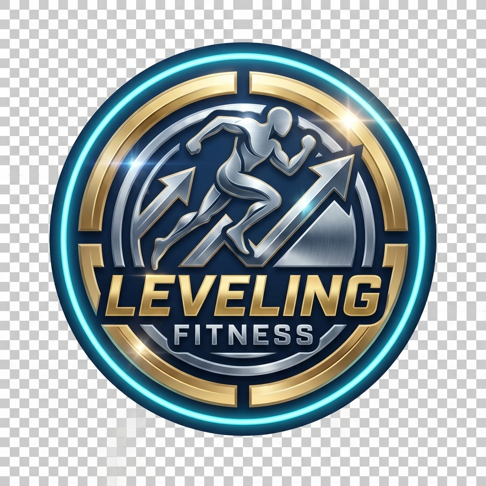
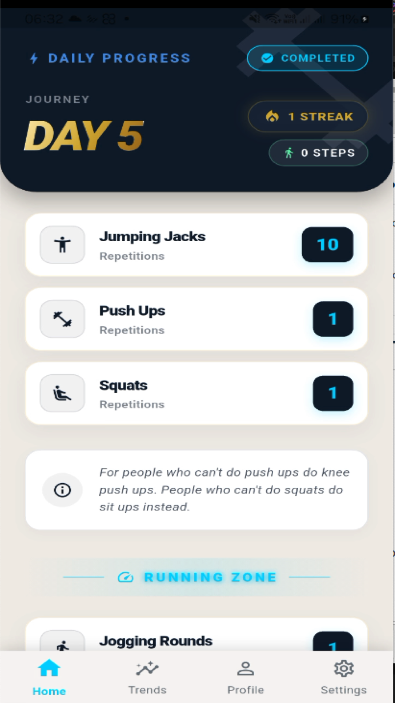
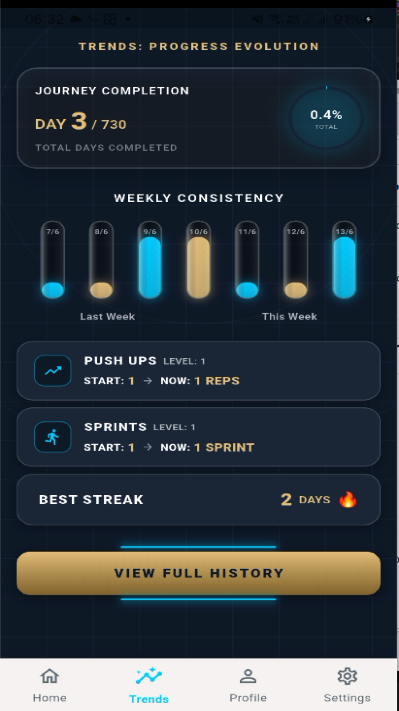
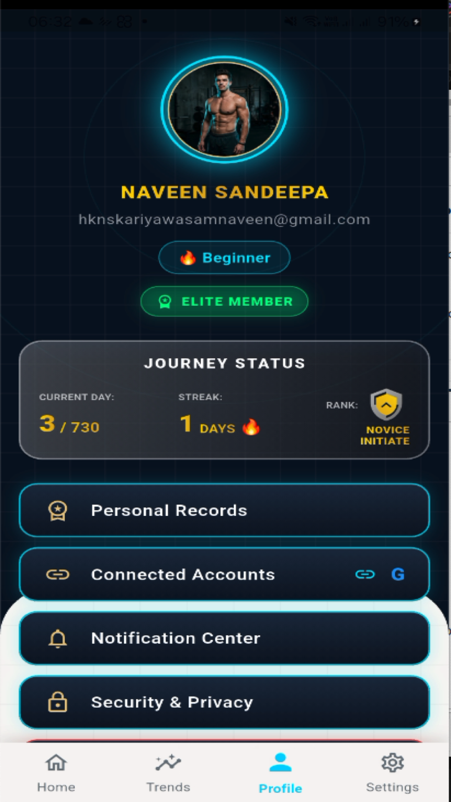
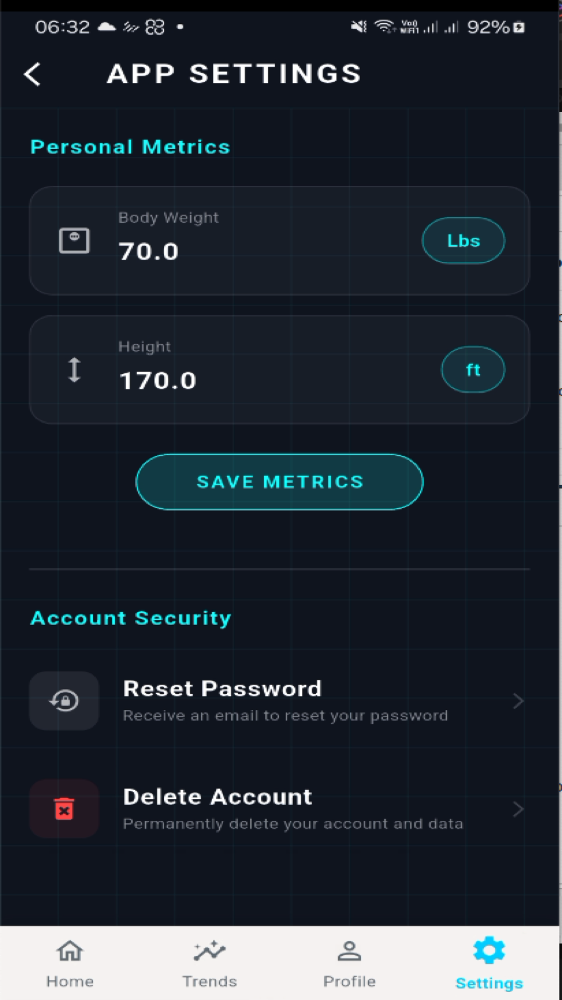
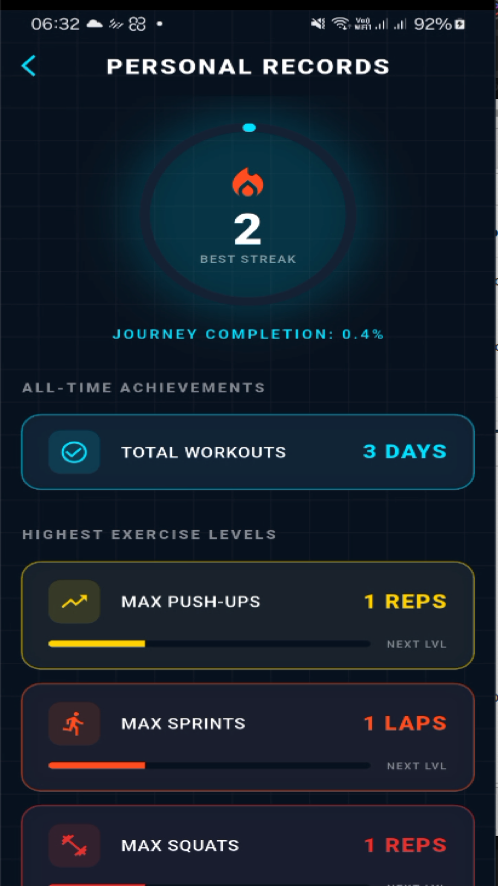
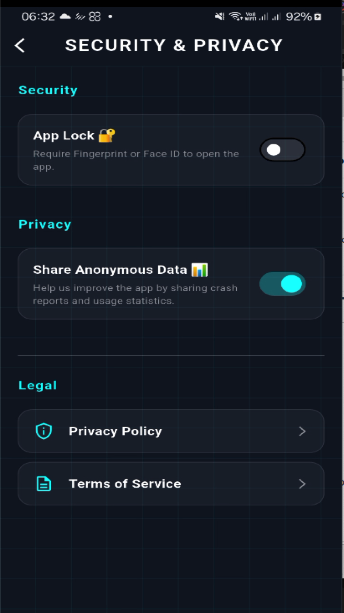

# Leveling Fitness

<div align="center">
  
  <br/>
  
  [](https://flutter.dev/)
  [](https://firebase.google.com/)
  [](https://opensource.org/licenses/MIT)
  []()
</div>

> A premium, modern Flutter fitness tracking application designed to help users log workouts, maintain daily streaks, and visualize their progress with a highly responsive user experience.

---

## 📑 Table of Contents
- [✨ Features](#-features)
- [📸 Screenshots](#-screenshots)
- [🛠 Tech Stack](#-tech-stack)
- [📂 Architecture](#-architecture)
- [🚀 Getting Started](#-getting-started)
- [📄 License](#-license)

---

## ✨ Features

- 🔐 **Secure Authentication**: Email/password and Google Sign-In powered by Firebase Auth.
- 📈 **Fitness Tracking**: Log daily workouts, maintain activity streaks, and earn dynamic fitness level badges.
- 🏃‍♂️ **Google Fit Integration**: Automatically sync step counts and activity data via the Health API.
- 💎 **Premium Subscriptions**: In-app purchases handled via RevenueCat to unlock advanced analytics and features.
- ⚙️ **Customizable Profile**: Track weight, height, and goals with metric/imperial unit toggling.
- 🔔 **Local Notifications**: Daily customizable workout reminders driven by `flutter_local_notifications`.
- 🛡️ **App Security**: Built-in App Lock feature using local biometrics.

---

## 📸 Screenshots

<table align="center">
  <tr>
    <td align="center"><b>Home Dashboard</b></td>
    <td align="center"><b>Trends Evolution</b></td>
    <td align="center"><b>User Profile</b></td>
  </tr>
  <tr>
    <td></td>
    <td></td>
    <td></td>
  </tr>
  <tr>
    <td align="center"><b>App Settings</b></td>
    <td align="center"><b>Personal Records</b></td>
    <td align="center"><b>Security & Privacy</b></td>
  </tr>
  <tr>
    <td></td>
    <td></td>
    <td></td>
  </tr>
</table>

---

## 🛠 Tech Stack

| Technology | Description | Badge |
| :--- | :--- | :--- |
| **Flutter** | Cross-platform UI toolkit |  |
| **Dart** | Programming Language |  |
| **Provider** | State Management |  |
| **Firebase** | Auth & Firestore |  |
| **RevenueCat**| In-App Subscriptions |  |

---

## 📂 Architecture

Built with a decoupled, maintainable **Multi-Provider Architecture**:

```text
lib/
├── models/         # Strongly-typed data models (UserProfile, FitnessProgress)
├── providers/      # State management (AuthProvider, SettingsProvider, FitnessDataProvider)
├── screens/        # UI Views (HomeScreen, LoginScreen, SettingsScreen, etc.)
├── utils/          # Helper classes (DateUtility, NotificationService, LegalTexts)
├── widgets/        # Reusable UI components (EliteTextField, PrimaryActionButton)
└── main.dart       # App entry point and Provider injection configuration
```

---

## 🚀 Getting Started

Follow these instructions to run the project locally on your machine.

### Prerequisites
- [Flutter SDK](https://flutter.dev/docs/get-started/install) (3.x or higher)
- Android Studio or Xcode (for emulation/builds)
- A Firebase Project (for Auth & Firestore)

### 1. Clone the repository
```bash
git clone https://github.com/kariyawasamnaveen/fitness-tracker-app.git
cd fitness-tracker-app
```

### 2. Configure Environment Variables
Create a `.env` file in the root directory of the project and add your RevenueCat API keys:
```env
# RevenueCat API Keys
REVENUECAT_APPLE_KEY=your_apple_api_key_here
REVENUECAT_GOOGLE_KEY=your_google_api_key_here
```

### 3. Install Dependencies
Fetch all required packages using pub:
```bash
flutter pub get
```

### 4. Run the App
Connect your physical device or launch an emulator, then run:
```bash
flutter run
```

---

## 📄 License
This project is licensed under the MIT License - see the [LICENSE](LICENSE) file for details.

<div align="center">
  <sub>Developed with ❤️ by <a href="https://github.com/kariyawasamnaveen">Naveen Kariyawasam</a></sub>
</div>
